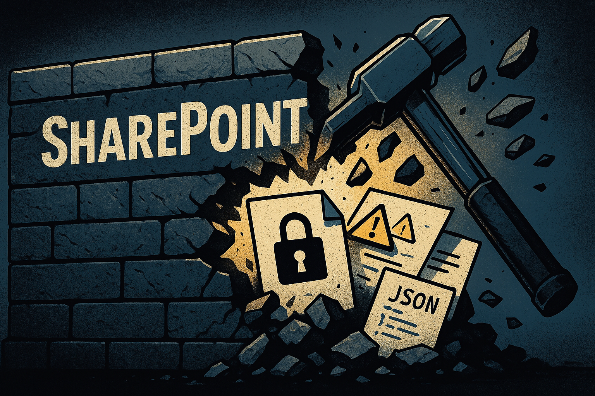

# ShareFiltrator

[](https://opensource.org/licenses/MIT)

A Python tool that leverages SharePoint’s `_api/search/query` endpoint to enumerate sensitive files potentially containing credentials and download them in bulk using authenticated session cookies.

**For detailed background, API internals, and mitigation strategies, please refer to the blog post:** https://blog.fndsec.net/2025/04/02/breaking-down-sharepoint-walls/

## Introduction

ShareFiltrator is a command-line tool designed to efficiently discover and optionally download files stored across SharePoint sites and OneDrive folders within a Microsoft 365 tenant. It utilizes SharePoint's search API and relies on authenticated session cookies (`rtFa` and `FedAuth`) extracted from a user's browser session.

The primary goal is to identify files exposed due to overly permissive sharing settings, which might contain sensitive information like credentials or secrets.

## Requirements

*   Python 3.x
*   Access to an authenticated Microsoft 365 / SharePoint session.
*   `rtFa` and `FedAuth` cookies from the authenticated session for the target SharePoint domain.

## Installation

1.  Clone the repository:
    ```bash
    git clone https://github.com/coleraffell/sharefiltrator2.git
    cd Sharefiltrator2
    ```
2.  (Optional, if dependencies exist) Install required Python packages:
    ```bash
    pip install -r requirements.txt
    ```

## Usage

You must extract the `rtFa` and `FedAuth` cookies for your target SharePoint domain (e.g., `yourcompany.sharepoint.com`) from your browser's developer tools after logging in.

```
usage: sharefiltrator.py [-h] -c <config_file>.yaml

originally, the following would all be command line arguments. However, you can now parse these through a yaml file. All 11 options can be found in example.yaml.

options:
  -h, --help            show this help message and exit
  -d DOMAIN, --domain DOMAIN
                        SharePoint domain (e.g., yourcompany.sharepoint.com)
  -r RTFA, --rtfa RTFA  rtFa cookie value
  -f FEDAUTH, --fedauth FEDAUTH
                        FedAuth cookie value
  -o OUTPUT_FILE, --output_file OUTPUT_FILE
                        Output file name for URLs
  -q QUERY, --query QUERY
                        Search query to use (default - finds sites & personal OneDrive folders which are shared)
  -rq REFINEMENT_FILTERS, --refinement_filters REFINEMENT_FILTERS
                        Refinement filters to use
  -s SAVE, --save SAVE  Folder name to download files found (example: 'files')
  -t MAX_THREADS, --max_threads MAX_THREADS
                        Max threads to use for file downloads (default: 10)
  -m MAX_SIZE, --max_size MAX_SIZE
                        Max file size to download in MB (default: 20 MB, example: 100)
  -p PRESET, --preset PRESET
                        Preset file with a line seprated list of queries to run
```

**Finding Cookies:**

Open your browser's developer tools (usually F12), navigate to the "Application" (Chrome/Edge) or "Storage" (Firefox) tab, select "Cookies", find your SharePoint domain, and copy the values for `rtFa` and `FedAuth`.

## New Usage

**Standard word search**

Enter the keywords you're searching for either as a list or singular:

```bash
queries: keyword
```
Or
```bash
queries: 
    - Keyword
    - keyword2
```

FQL search is set true by default, allowing for queries such as:

```bash
OR(\"username\", \"user\", \"login\", \"password\", \"passwd\", \"passw\")
```

**Advanced Searches**

creds.json and snaffpoint.json are examples of presets. These can be linked into the yaml file the same as they would command line. Refinment filters can be used as standard also. For example:

```bash
filetype:or(\"txt\",\"log\",\"csv\",\"yml\",\"yaml\")
```

Arguments are the same as original, rename the output_file/csv as you wish. See the original usage below.

## Original Example Usage

**Run a default query and save URLs:**

```bash
python sharefiltrator.py -d yourcompany.sharepoint.com -r <rtFa_cookie_value> -f <FedAuth_cookie_value> -o discovered_urls.txt
```

**Search for files containing "password" and download them:**

```bash
python sharefiltrator.py -d yourcompany.sharepoint.com -r <rtFa_cookie> -f <FedAuth_cookie> -o password_files.txt -q "password" -s downloaded_passwords
```

**Run the Snaffpoint preset queries, download files up to 50MB:**

```bash
python sharefiltrator.py -d yourcompany.sharepoint.com -p ./presets/snaffpoint.json -s snaffpoint_results -r <rtFa_cookie> -f <FedAuth_cookie> -o snaffpoint_urls.txt -m 50
```

**Run the Creds preset queries with 20 download threads:**

```bash
python sharefiltrator.py -d yourcompany.sharepoint.com -p ./presets/creds.json -s cred_results -r <rtFa_cookie> -f <FedAuth_cookie> -o creds_urls.txt
```

## Preset Queries

Use the `-p` flag to specify a JSON file containing multiple queries to run sequentially. Two presets are included:

*   `presets/snaffpoint.json`: Rules inspired by Snaffler/Snaffpoint.
*   `presets/creds.json`: Fine-tuned rules focusing on credentials and secrets.

Results from all queries in the preset are appended to the output file (`-o`), and matching files are downloaded to the save directory (`-s`), if specified.

## Post-Enumeration Strategy

After running ShareFiltrator, especially if many files are downloaded (`-s <folder>`):

1.  **Automated Credential Scanning:** Use tools like [Snaffler](https://github.com/SnaffCon/Snaffler) on the download directory.
2.  **AI/Scripted Analysis:** Process file contents programmatically to extract potential secrets.
3.  **Manual Code Search:** Use VSCode or similar tools with global search (`CTRL + SHIFT + F`) in the download directory for keywords.
4.  **Review URL List:** Check the `-o` file for interesting file names (`config`, `.env`, `backup`, `credentials`, etc.).
5.  **Explore Surroundings:** If a sensitive file is found, check its parent directory in SharePoint/OneDrive for other potentially missed files.

## References & Credits

*   **Blog Post:** https://blog.fndsec.net/2025/04/02/breaking-down-sharepoint-walls/
*   **Base Idea & Implementation Aspects:** [Snaffpoint](https://github.com/nccgroup/SnaffPoint)
*   **Query Templates & Inspiration:** [Snaffler](https://github.com/SnaffCon/Snaffler)
